# Jibola Ishola – Personal Portfolio


A personal portfolio website showcasing my skills in HTML and CSS web development.

**Live site:** https://jibs-jori.github.io/jibola-portfolio/

**GitHub repository:** https://github.com/jibs-jori/jibola-portfolio

---

## Overview

This is a multi-page static website built with HTML5 and CSS3. It is a portfolio project designed to showcase my web development skills, introduce who I am, show projects I have worked on, and allow visitors to get in touch.

---

## User Stories

### 1. As a recruiter

I want to immediately understand who Jibola is and what he does, so that I can quickly assess whether he is a suitable candidate.

- **Feature:** Homepage hero section
- **Acceptance Criteria:**
  - Name and introduction visible immediately
  - Three highlight cards showing IT Support, Web Development, Always Improving
  - Navigation links to all pages
- **Evidence:** Homepage displays name, welcome message, and feature cards.
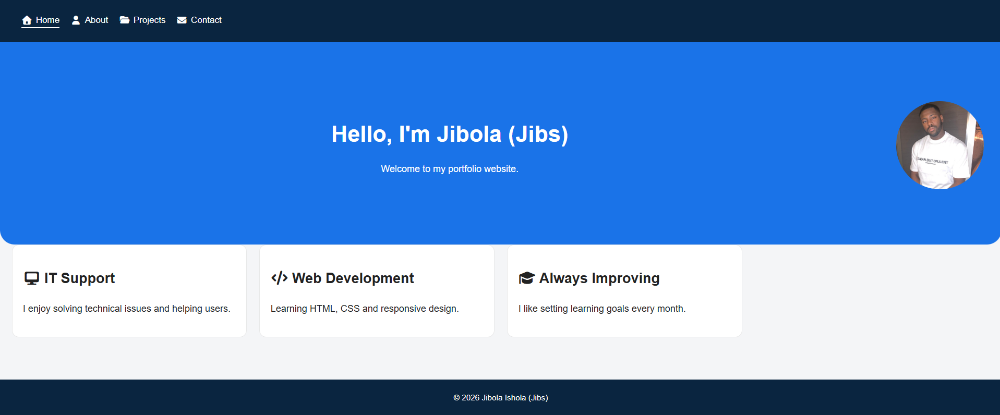

---

### 2. As a visitor

I want to navigate the site easily on any device, so that I can find the information I need without confusion.

- **Feature:** Responsive navigation bar with hamburger menu
- **Acceptance Criteria:**
  - Nav links present on every page
  - Active page highlighted
  - Hamburger menu on mobile
- **Evidence:** Nav bar collapses to hamburger on mobile with active page underline visible.
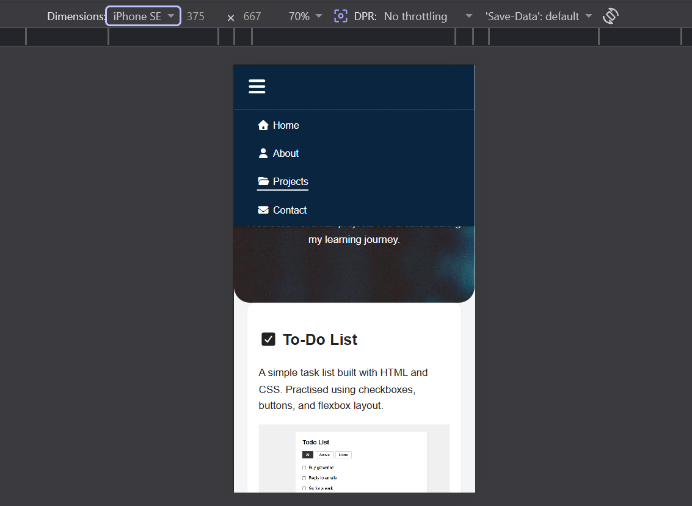

---

### 3. As a recruiter

I want to view examples of completed projects, so that I can evaluate practical HTML and CSS skills.

- **Feature:** Projects page with three card thumbnails
- **Acceptance Criteria:**
  - Three projects displayed with title, description, and screenshot
  - Cards stack on mobile, sit side by side on larger screens
- **Evidence:** Three project cards (To-Do List, Learning Log, Practice Layouts) displayed with screenshots.
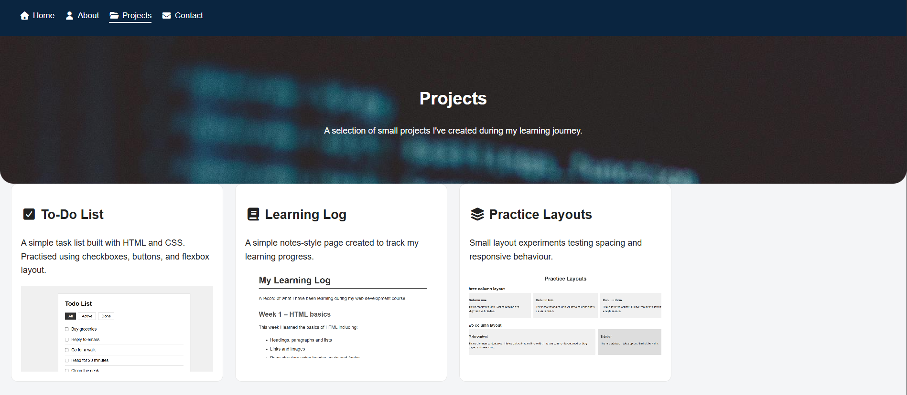

---

### 4. As a collaborator

I want to contact Jibola directly, so that I can reach out about a project or opportunity.

- **Feature:** Contact form with thank-you page redirect
- **Acceptance Criteria:**
  - Form includes name, email, and message fields
  - All fields marked as `required` so form cannot be submitted empty
  - Email field uses `type="email"` to validate format
  - User is redirected to a thank-you page on submission
- **Evidence:** Contact form redirects to thanks.html on successful submission.
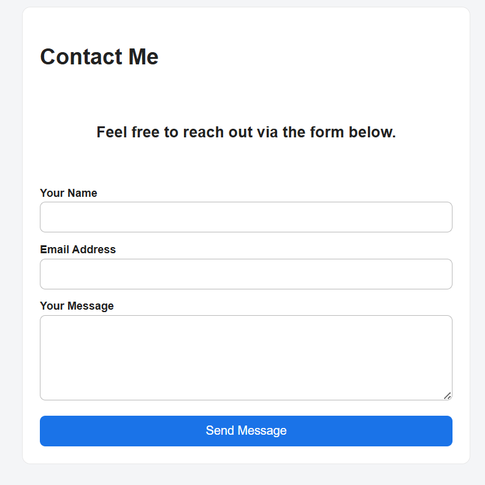

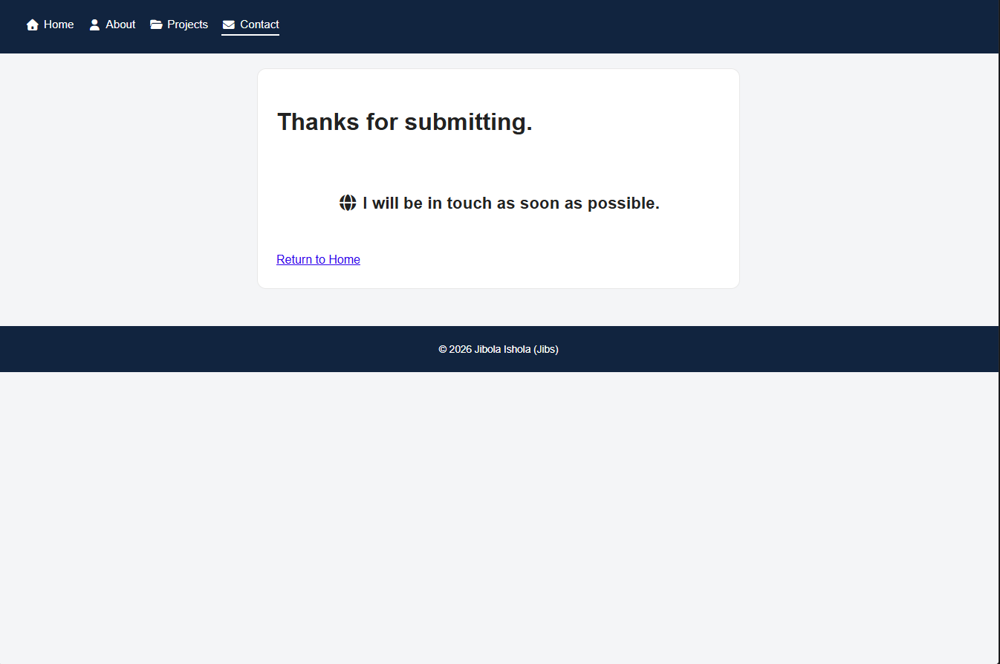

---

### 5. As a visitor

I want to view the site comfortably on a mobile, so that I can browse without zooming or horizontal scrolling.

- **Feature:** Responsive layout using CSS media queries
- **Acceptance Criteria:**
  - No horizontal scrolling at 375px
  - Text readable without zooming
  - Cards stack vertically on mobile
- **Evidence:** Site tested at 375px, 768px, and 1280px using Chrome DevTools.
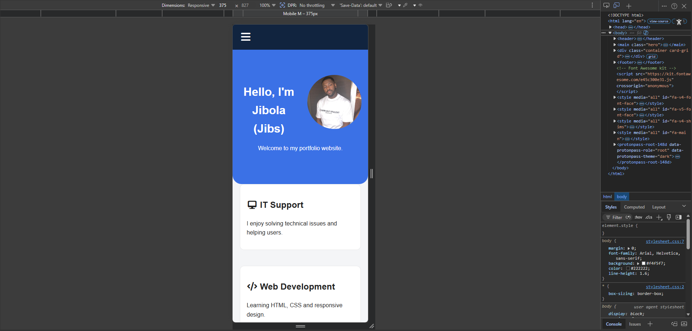
---

## User Story Traceability

| User Story | Feature Delivered | Evidence |
|------------|------------------|----------|
| US1 | Homepage hero and feature cards | index.html |
| US2 | Responsive nav with active state | All pages |
| US3 | Projects page with three thumbnails | projects.html |
| US4 | Contact form with thank-you page redirect | contact.html + thanks.html |
| US5 | Responsive layout with media queries | stylesheet.css |

---

## Wireframes

Below are the wireframes created during the planning stage of the project. They show the layout planned for both desktop and mobile before any code was written.

---

### Home Page

#### Desktop
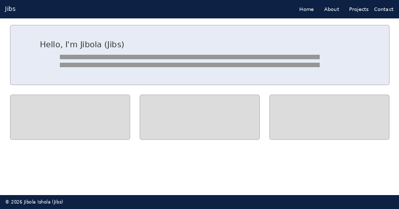

#### Mobile
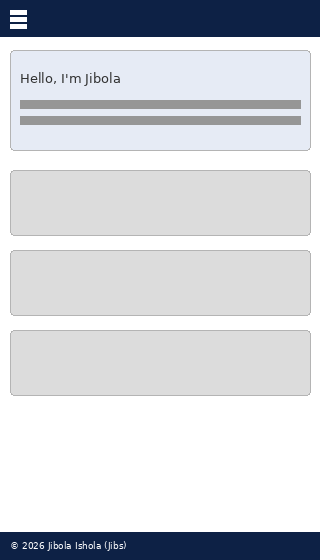

---

### About Page

#### Desktop
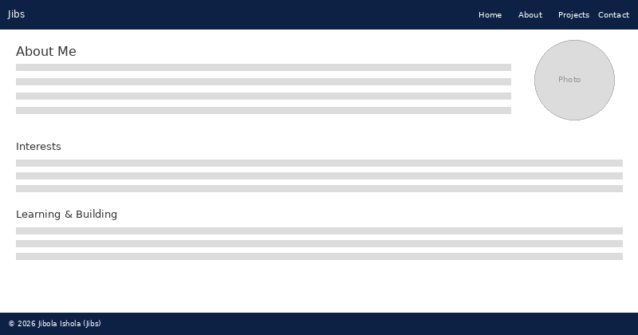

#### Mobile
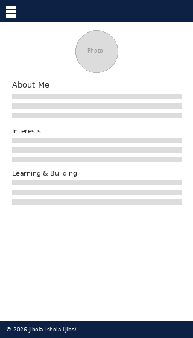

---

### Projects Page

#### Desktop
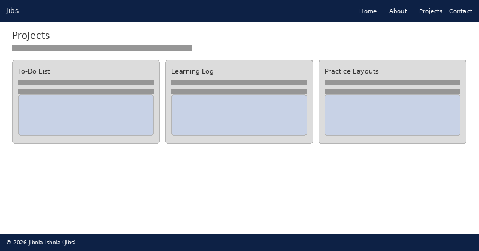

#### Mobile
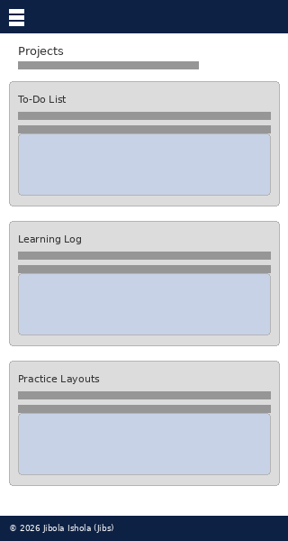

---

### Contact Page

#### Desktop
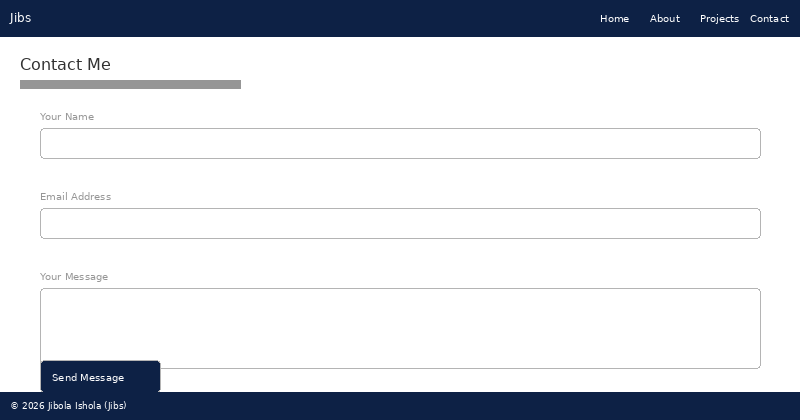

#### Mobile
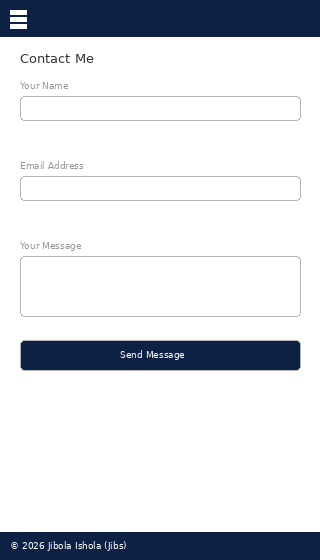

---

## Technology Stack

- **HTML5** – Structure and semantic layout of the website
- **CSS3** – Styling, layout, and responsive design using media queries and flexbox
- **Font Awesome** – Icons used in the navigation bar and project cards
- **Git & GitHub** – Version control and code repository
- **GitHub Pages** – Deployment of the live site
- **VS Code** – Code editor used throughout development
- **Google Chrome DevTools** – Used for responsive testing and debugging
- **W3C HTML Validator** – Used to validate all HTML pages
- **W3C CSS Validator** – Used to validate the stylesheet
- **Favicon.io** – Used to generate the browser tab favicon
- **Pexels** – Source of the navigation background image (Markus Spiske)

---

## Use of AI Tools

During the development of this project, AI tools were used to support learning, problem solving, testing, and troubleshooting. They were not used to write the project from scratch.

### ChatGPT

ChatGPT was used to help diagnose and fix specific coding errors and to assist with testing and troubleshooting throughout development. For example:

- Identifying why the hamburger menu was not collapsing correctly on mobile
- Explaining why backslashes in image paths were causing W3C validator errors
- Helping understand why heading levels were skipping (h1 → h3) and how to fix them
- Suggesting how to use `object-fit: cover` and `object-position: top` to make project thumbnails display consistently inside cards
- Troubleshooting the contact form which returned a 405 Not Allowed error on the live site — identifying that GitHub Pages does not support POST requests and advising to switch to `method="GET"` with a relative path action
- Advising that `name` attributes were missing from form fields, which was preventing the GET form from submitting correctly

All code suggestions were reviewed, understood, and manually applied by me before being committed to the project.

### Microsoft Copilot

Microsoft Copilot was used to assist with CSS styling decisions and to help interpret browser errors during testing. For example:

- Advising on how to blend a background image with a colour overlay using `background-blend-mode: multiply` for the navigation bar
- Suggesting how to structure the card grid using CSS Grid and media queries for responsive behaviour across screen sizes
- Helping refine spacing and padding values to achieve a cleaner layout
- Helping interpret the 405 Not Allowed and 404 errors encountered when testing the contact form on the deployed site, and explaining the difference between how forms behave locally versus on GitHub Pages

Both tools were used as learning aids rather than replacements for writing and understanding the code myself.

---

## Testing

### Manual testing

| Test | Result |
|------|--------|
| All nav links work on every page | Pass |
| Active page highlighted in nav | Pass |
| Hamburger menu opens and closes on mobile | Pass |
| Contact form rejects empty submission | Pass |
| Contact form rejects invalid email | Pass |
| Contact form submits and redirects to thank-you page | Pass |
| Profile photo loads on About page | Pass |
| Project screenshots load on Projects page | Pass |
| Footer visible on all pages | Pass |

### Responsive testing

Tested using Chrome DevTools at the following screen widths:

| Device | Width | Result |
|--------|-------|--------|
| iPhone SE | 375px | Pass |
| iPad | 768px | Pass |
| Desktop | 1280px | Pass |

### Validation

**HTML** – all pages passed the [W3C HTML Validator](https://validator.w3.org/) with no errors.

**CSS** – stylesheet passed the [W3C CSS Validator](https://jigsaw.w3.org/css-validator/) with no errors.

### Bugs fixed

| Bug | Cause | Fix |
|-----|-------|-----|
| Stray script tag error in validator | Font Awesome script placed after `</body>` | Moved script to inside `</body>` |
| Heading level skipping h1 → h3 | Feature cards used `<h3>` directly after `<h1>` | Changed to `<h2>` |
| Backslash in image path | Windows-style path used in `src` attribute | Changed `\` to `/` |
| `height: absolute` CSS error | Invalid value used for height property | Changed to `height: 180px` |
| Todo List nested inside Portfolio card | Content from old structure not removed | Separated into its own card and later removed |
| Contact form returning 405 Not Allowed on live site | GitHub Pages does not support POST requests | Changed form `method` from `POST` to `GET` |
| Contact form returning 404 after method change | Absolute path `/jibola-portfolio/thanks.html` used in action | Changed to relative path `thanks.html` |
| Contact form not submitting correctly | `name` attributes missing from all form fields | Added `name="name"`, `name="email"`, `name="message"` to each field |

---

## Deployment

The site was deployed using GitHub Pages from the `main` branch.

1. Pushed all files to the `main` branch on GitHub
2. Went to repository **Settings → Pages**
3. Selected `main` branch and `/ (root)` as the source
4. GitHub Pages published the site automatically

To run locally, clone the repo and open `index.html` in a browser:

```bash
git clone https://github.com/jibs-jori/jibola-portfolio.git
```

---

## Credits

- Profile photo – personal photograph
- Navigation background – [Markus Spiske via Pexels](https://www.pexels.com/photo/6190327/)
- Project screenshots – captured using Chrome DevTools
- Icons – [Font Awesome](https://fontawesome.com/)
- Favicon – [Favicon.io](https://favicon.io/)

