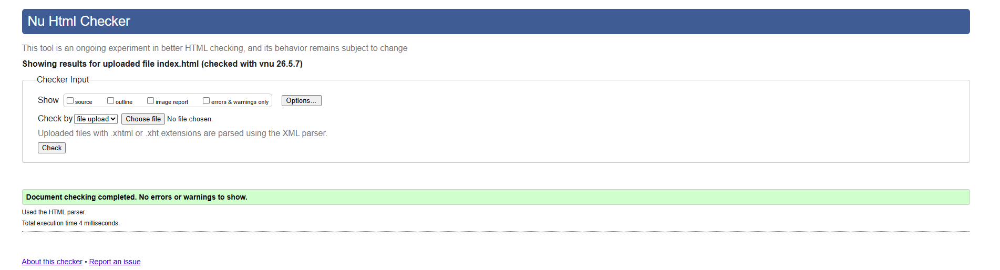
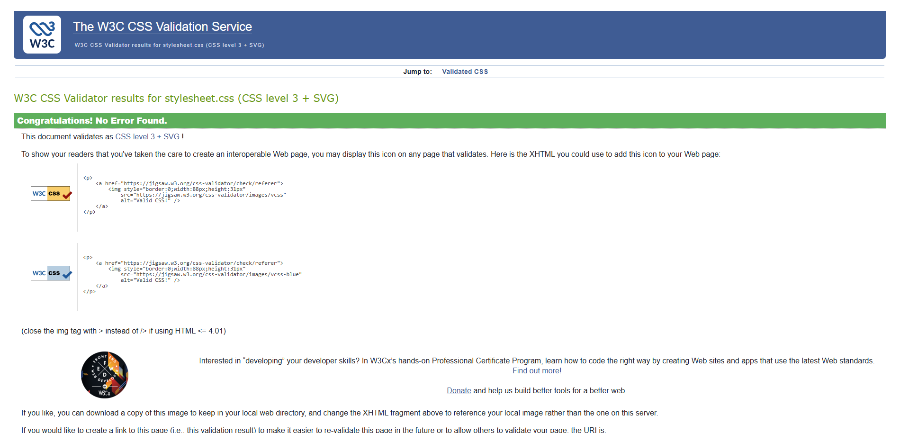

# Jibola Ishola – Personal Portfolio

A personal portfolio website showcasing my skills in HTML and CSS web development.

**Live site:** https://jibs-jori.github.io/jibola-portfolio/

**GitHub repository:** https://github.com/jibs-jori/jibola-portfolio

---

## Overview
 
This is a multi-page static website built with HTML5 and CSS3. It is a portfolio project designed to showcase my web development skills, introduce who I am, show projects I have worked on, and allow visitors to get in touch.
 
The site includes five pages: Home, About, Projects, Contact, and a Thank You confirmation page. It is fully responsive and has been tested across multiple screen sizes.
 
---

## Purpose and Target Audience
 
The purpose of this project is to create a professional online presence that allows potential employers, recruiters, and collaborators to learn about me, view my work, and get in touch.
 
**Target audiences:**
- Potential employers and recruiters looking to assess front-end development skills
- Collaborators interested in working on technical or web projects
- Anyone looking to contact me directly

---

## User Stories
 
### US1 – As a potential employer
 
I want to see an overview of Jibola's skills and background as soon as I land on the site, so that I can quickly assess whether he fits a role I have available.
 
- **Feature:** Homepage hero section with introduction and skill cards
- **Acceptance Criteria:**
  - Name and introduction visible immediately on page load
  - Three highlight cards showing IT Support, Web Development, Always Improving
  - Navigation links to all pages present in the header
- **Result:** All criteria met.

 
---
 
### US2 – As a visitor
 
I want to navigate the site easily on any device, so that I can find the information I need without confusion.
 
- **Feature:** Responsive navigation bar with hamburger menu on mobile
- **Acceptance Criteria:**
  - Nav links present and functional on every page
  - Active page clearly highlighted
  - Navigation collapses to a hamburger menu on mobile screens
- **Result:** All criteria met.

 
---
 
### US3 – As a recruiter
 
I want to view examples of completed projects, so that I can evaluate Jibola's practical HTML and CSS skills.
 
- **Feature:** Projects page with three project cards and thumbnails
- **Acceptance Criteria:**
  - Three projects displayed with title, description, and screenshot
  - Cards sit side by side on desktop and stack vertically on mobile
- **Result:** All criteria met.

 
---
 
### US4 – As a collaborator
 
I want to contact Jibola directly through the site, so that I can reach out about a project or opportunity.
 
- **Feature:** Contact form with validation and thank-you page redirect
- **Acceptance Criteria:**
  - Form includes name, email, and message fields
  - All fields marked as `required` — form cannot be submitted empty
  - Email field uses `type="email"` to validate format
  - User is redirected to a confirmation page on submission
- **Result:** All criteria met.

 

 
---
 
### US5 – As a mobile user
 
I want the site to work well on my phone, so that I can browse Jibola's portfolio on any device without zooming or horizontal scrolling.
 
- **Feature:** Responsive layout using CSS media queries
- **Acceptance Criteria:**
  - No horizontal scrolling at 375px viewport width
  - Text is readable without zooming
  - Cards and content stack vertically on small screens
- **Result:** All criteria met. Tested at 375px, 768px, and 1280px.

 
---
 
## User Story Traceability
 
| User Story | Feature Delivered | Page / File |
|------------|------------------|-------------|
| US1 – Employer overview | Homepage hero and feature cards | index.html |
| US2 – Easy navigation | Responsive nav with active state and hamburger | All pages |
| US3 – View projects | Projects page with three thumbnails | projects.html |
| US4 – Contact form | Form with validation and thank-you redirect | contact.html + thanks.html |
| US5 – Mobile experience | Responsive layout with CSS media queries | stylesheet.css |
 
---
 
## Wireframes
 
Below are the wireframes created during the planning stage of the project. They show the layout planned for both desktop and mobile before any code was written.
 
### Home Page
 
#### Desktop

 
#### Mobile

 
---
 
### About Page
 
#### Desktop

 
#### Mobile

 
---
 
### Projects Page
 
#### Desktop

 
#### Mobile

 
---
 
### Contact Page
 
#### Desktop

 
#### Mobile

 
---
 
## Technology Stack
 
- **HTML5** – Structure and semantic layout of the website
- **CSS3** – Styling, layout, and responsive design using media queries and flexbox
- **Font Awesome** – Icons used in the navigation bar and project cards
- **Git & GitHub** – Version control and code repository
- **GitHub Pages** – Deployment of the live site
- **VS Code** – Code editor used throughout development
- **Google Chrome DevTools** – Used for responsive testing and debugging
- **W3C HTML Validator** – Used to validate all HTML pages
- **W3C CSS Validator (Jigsaw)** – Used to validate the stylesheet
- **Favicon.io** – Used to generate the browser tab favicon
- **Pexels** – Source of the navigation background image (Markus Spiske)
---
 
## Use of AI Tools
 
During the development of this project, AI tools were used to support learning, problem solving, testing, and troubleshooting. They were not used to write the project from scratch.
 
### ChatGPT
 
ChatGPT was used to help diagnose and fix specific coding errors and to assist with testing and troubleshooting throughout development. For example:
 
- Identifying why the hamburger menu was not collapsing correctly on mobile
- Explaining why backslashes in image paths were causing W3C validator errors
- Helping understand why heading levels were skipping (h1 → h3) and how to fix them
- Suggesting how to use `object-fit: cover` and `object-position: top` to make project thumbnails display consistently inside cards
- Troubleshooting the contact form which returned a 405 Not Allowed error on the live site — identifying that GitHub Pages does not support POST requests and advising to switch to `method="GET"` with a relative path action
- Advising that `name` attributes were missing from form fields, which was preventing the GET form from submitting correctly
All code suggestions were reviewed, understood, and manually applied by me before being committed to the project.
 
### Microsoft Copilot
 
Microsoft Copilot was used to assist with CSS styling decisions and to help interpret browser errors during testing. For example:
 
- Advising on how to blend a background image with a colour overlay using `background-blend-mode: multiply` for the navigation bar
- Suggesting how to structure the card grid using CSS Grid and media queries for responsive behaviour across screen sizes
- Helping refine spacing and padding values to achieve a cleaner layout
- Helping interpret the 405 Not Allowed and 404 errors encountered when testing the contact form on the deployed site, and explaining the difference between how forms behave locally versus on GitHub Pages
Both tools were used as learning aids rather than replacements for writing and understanding the code myself.
 
---

## Testing

### Manual testing

| Test | Result |
|------|--------|
| All nav links work on every page | Pass |
| Active page highlighted in nav | Pass |
| Hamburger menu opens and closes on mobile | Pass |
| Contact form rejects empty submission | Pass |
| Contact form rejects invalid email | Pass |
| Contact form submits and redirects to thank-you page | Pass |
| Profile photo loads on About page | Pass |
| Project screenshots load on Projects page | Pass |
| Footer visible on all pages | Pass |

### Responsive testing

Tested using Chrome DevTools at the following screen widths:

| Device | Width | Result |
|--------|-------|--------|
| iPhone SE | 375px | Pass |
| iPad | 768px | Pass |
| Desktop | 1280px | Pass |

### Validation
 
**HTML** — All five HTML pages were checked using the [Nu Html Checker (W3C)](https://validator.w3.org/) and returned no errors or warnings.
 

 
**CSS** — The stylesheet was validated using the [W3C CSS Validation Service (Jigsaw)](https://jigsaw.w3.org/css-validator/) and passed with no errors.
 

 
---
 
### Bugs Fixed
 
| Bug | Cause | Fix Applied |
|-----|-------|-------------|
| Stray script tag error in validator | Font Awesome script placed after `</body>` | Moved script to inside `<body>` before closing tag |
| Heading level skipping h1 → h3 | Feature cards used `<h3>` directly after `<h1>` | Changed feature card headings to `<h2>` |
| Backslash in image path | Windows-style path used in `src` attribute | Changed `\` to `/` throughout |
| `height: absolute` CSS error | Invalid value used for height property | Changed to `height: 180px` |
| Todo List nested inside Portfolio card | Content from old structure not removed | Separated into its own card, then removed during refactor |
| Contact form returning 405 Not Allowed on live site | GitHub Pages does not support POST requests | Changed form `method` from `POST` to `GET` |
| Contact form returning 404 after method change | Absolute path `/jibola-portfolio/thanks.html` used in `action` | Changed to relative path `thanks.html` |
| Contact form not submitting correctly | `name` attributes missing from all form fields | Added `name="name"`, `name="email"`, `name="message"` to each field |
 
### Known Limitations
 
- The contact form uses a `GET` method due to GitHub Pages not supporting server-side processing. In a real deployment, a backend or third-party form service (such as Formspree) would be used to handle POST submissions securely.
- The thanks page is accessible directly via URL without submitting the form. This is a static site limitation and would be resolved with server-side form handling in a future version.
---
 
## Development Process
 
### Planning
 
The project began with defining a clear purpose — to create a personal portfolio that introduces me, showcases my work, and allows visitors to get in touch. User stories were written first to define what each type of visitor would need from the site, and wireframes were drawn to plan the layout of each page before coding started.
 
### Design
 
The colour scheme uses a dark navy header and footer with a blue hero section, providing contrast and a professional look. Cards use a light background to keep content readable. Font Awesome icons were added to navigation and cards to support visual hierarchy. The profile image uses a circular crop for a clean, modern appearance.
 
### Build
 
Pages were built in order: index.html first, then about.html, projects.html, contact.html, and finally thanks.html. A single external stylesheet (`stylesheet.css`) handles all styling. Media queries were added progressively as each page was completed, targeting 768px as the main breakpoint for responsive layout changes.
 
### Testing
 
Manual testing was carried out throughout development in Chrome DevTools and on the deployed GitHub Pages site. Validation was run at the end of development on all HTML files and the CSS stylesheet. Bugs found during testing are documented in the Bugs Fixed table above.
 
### Deployment
 
The site was deployed using GitHub Pages from the `main` branch at the end of development. The live site was checked against the local version to confirm they matched.
 
---
 
## Deployment
 
The site was deployed using GitHub Pages from the `main` branch.
 
**Steps taken:**
 
1. All files pushed to the `main` branch on GitHub
2. Navigated to repository **Settings → Pages**
3. Selected `main` branch and `/ (root)` as the source
4. GitHub Pages generated and published the live URL automatically
**To run locally**, clone the repository and open `index.html` in a browser:
 
```bash
git clone https://github.com/jibs-jori/jibola-portfolio.git
```
 
No dependencies or installations are required. All pages open directly in any modern browser.
 
---
 
## Credits
 
- Profile photo — personal photograph
- Navigation background — [Markus Spiske via Pexels](https://www.pexels.com/photo/6190327/)
- Project screenshots — captured using Chrome DevTools
- Icons — [Font Awesome](https://fontawesome.com/)
- Favicon — [Favicon.io](https://favicon.io/)
